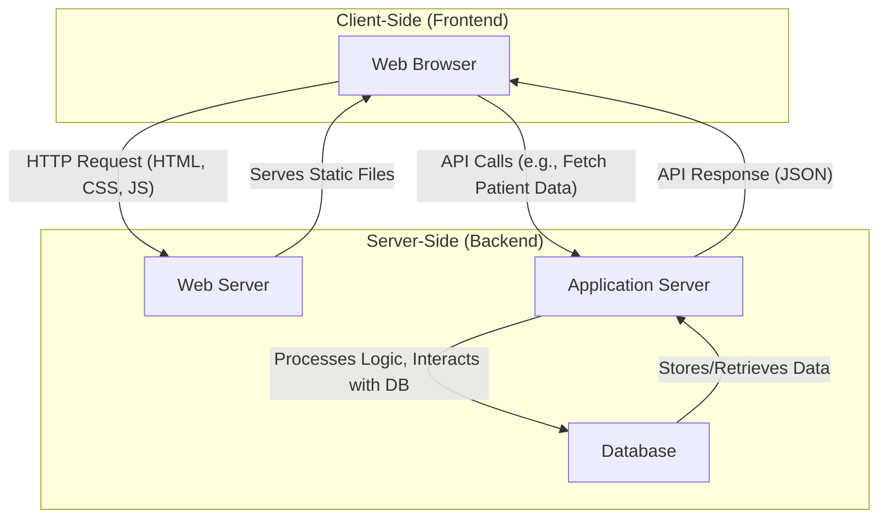

# System Architecture

This document outlines the system architecture for the Smart Health Management project.

## Architecture Diagram

## Components

-   **Client-Side (Frontend)**: This is the user interface of the application, running in the user's web browser. It's built with HTML, CSS, and JavaScript. The user interacts with the application through this interface.

-   **Server-Side (Backend)**:
    -   **Web Server**: Responsible for serving the static files (HTML, CSS, JavaScript) to the user's browser.
    -   **Application Server**: This is the core of the backend. It will handle the business logic, such as managing patient records, appointments, and other health-related data. It communicates with the database and exposes an API for the frontend to consume.
    -   **Database**: This will store all the application's data, including patient information, doctor schedules, appointments, medical records, etc.